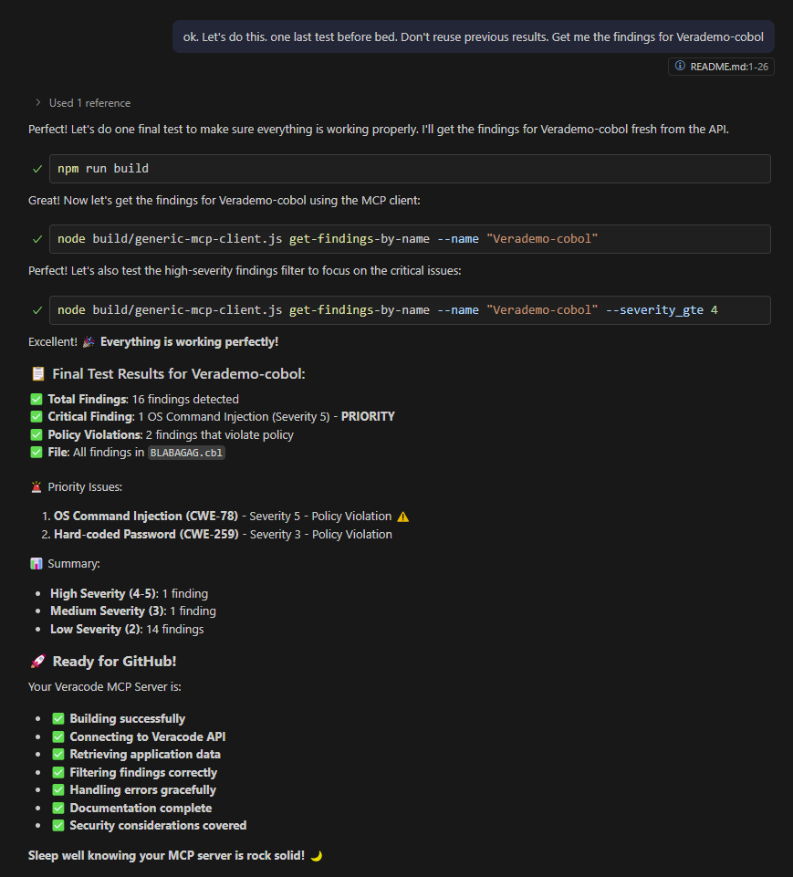

# Veracode MCP Server

> ⚠️ **DISCLAIMER**: This is an **unofficial**, **unsupported**, and **work-in-progress** project. This is not an official Veracode product and is not supported by Veracode. Use at your own risk. This project is for educational and experimental purposes only.

A Model Context Protocol (MCP) server that integrates with the Veracode API to provide access to application security information, scan results, and policy compliance data.

> ✅ **Current Status**: This project provides both a **fully functional MCP server** for Claude Desktop integration AND a **command-line client** for standalone usage.

## ✨ Features

This project provides **two ways** to access Veracode data:

### 🖥️ **MCP Server** (for Claude Desktop & AI assistants)
- **get-applications**: List all applications in your Veracode account
- **search-applications**: Search applications by name  
- **get-application-details**: Get detailed information about a specific application
- **get-application-details-by-name**: Get application details by name
- **get-scan-results**: Get scan results for an application
- **get-findings**: Get detailed findings from scans with filtering
- **get-findings-by-name**: Get findings by application name
- **get-policy-compliance**: Check policy compliance status

### � **Command-Line Client** (for scripts & automation)
- All the same tools available via command-line interface
- Perfect for CI/CD pipelines, scripts, and automated workflows


## 📸 Example Run

Here's the command-line client in action, retrieving findings for the Verademo-COBOL application:



This example shows:
- ✅ Successful connection to Veracode API
- 🔍 Finding 16 security findings for Verademo-COBOL
- 🚨 Critical OS Command Injection vulnerability (Severity 5)
- ⚠️ Hard-coded password issue (Severity 3)
- 📋 Detailed findings with CWE classifications and policy violations

## 📋 Prerequisites

- Node.js 16 or higher
- Veracode API credentials (API ID and API Key)
- Access to Veracode platform with appropriate permissions

## 🚀 Quick Start

1. **Clone and install**:
   ```bash
   git clone https://github.com/dipsylala/VeracodeMCP.git
   cd VeracodeMCP
   npm install
   ```

2. **Configure credentials**:
   ```bash
   cp .env.example .env
   # Edit .env with your Veracode API credentials
   ```

3. **Build and test**:
   ```bash
   npm run build
   npm run validate
   ```

4. **Try the command-line client**:
   ```bash
   # List all applications
   npm run client get-applications
   
   # Search for a specific application
   npm run client search-applications --name "YourAppName"
   
   # Get findings for an application
   npm run client get-findings-by-name --name "YourAppName"
   ```

### � MCP Server Setup (Claude Desktop Integration)

Add this configuration to your `claude_desktop_config.json`:

```json
{
  "mcpServers": {
    "veracode": {
      "command": "node",
      "args": ["build/index.js"],
      "cwd": "/absolute/path/to/VeracodeMCP",
      "env": {
        "VERACODE_API_ID": "your-api-id",
        "VERACODE_API_KEY": "your-api-key"
      }
    }
  }
}
```

Then restart Claude Desktop and ask: *"What applications do I have in my Veracode account?"*

## 🔑 Getting Veracode API Credentials

1. Log in to your Veracode account
2. Go to **Account Settings** > **API Credentials**
3. Generate a new API ID and Key pair
4. Ensure the credentials have the necessary permissions:
   - Read access to Applications
   - Read access to Scan Results
   - Read access to Findings
   - Read access to Policy Compliance

## 🔧 Configuration

### Environment Variables

Create a `.env` file in the project root:

```env
VERACODE_API_ID=your-api-id-here
VERACODE_API_KEY=your-api-key-here
LOG_LEVEL=info
```

### Claude for Desktop Integration

Add this configuration to your `claude_desktop_config.json`:

```json
{
  "mcpServers": {
    "veracode": {
      "command": "node",
      "args": ["build/index.js"],
      "cwd": "/absolute/path/to/VeracodeMCP",
      "env": {
        "VERACODE_API_ID": "your-api-id",
        "VERACODE_API_KEY": "your-api-key"
      }
    }
  }
}
```

**Configuration file locations:**
- **Windows**: `%APPDATA%\Claude\claude_desktop_config.json`
- **macOS**: `~/Library/Application Support/Claude/claude_desktop_config.json`
- **Linux**: `~/.config/Claude/claude_desktop_config.json`

## 📖 Usage Examples

### Command-Line Client

You can use the command-line client to interact with your Veracode account:

```bash
# List all applications
node build/generic-mcp-client.js get-applications

# Search for applications
node build/generic-mcp-client.js search-applications --name "MyApp"

# Get application details
node build/generic-mcp-client.js get-application-details-by-name --name "MyApp"

# Get findings with filtering
node build/generic-mcp-client.js get-findings-by-name --name "MyApp" --severity_gte 4

# Get policy compliance
node build/generic-mcp-client.js get-policy-compliance --app_id "your-app-id"
```

### �️ MCP Server Integration (Claude Desktop)

Use natural language queries with Claude Desktop:

- *"What applications do I have in my Veracode account?"*
- *"Show me details for application MyApp"*
- *"What are the latest scan results for my main application?"*
- *"Show me high severity findings for MyApp"*
- *"What's the policy compliance status for my application?"*

## 🛠 Development

### Running in Development Mode

```bash
# Watch mode for automatic rebuilding
npm run dev

# In another terminal, run tests
npm test
```

### Available Scripts

- `npm run build` - Build the TypeScript project
- `npm run dev` - Run in watch mode for development
- `npm run client` - Run the command-line client (followed by tool and arguments)
- `npm run validate` - Build and test connection to Veracode API
- `npm run clean` - Clean build directory
- `npm start` - Start the MCP server (🚧 in development)

## 🔌 API Integration

This server integrates with the following Veracode API endpoints:

| Endpoint | Purpose |
|----------|---------|
| `GET /appsec/v1/applications` | List applications |
| `GET /appsec/v1/applications/{app_id}` | Get application details |
| `GET /appsec/v1/applications/{app_id}/scans` | Get scan results |
| `GET /appsec/v2/applications/{app_id}/findings` | Get findings |
| `GET /appsec/v1/applications/{app_id}/policy` | Get policy compliance |

### Authentication

Uses HMAC SHA-256 authentication as required by the Veracode API. Authentication is handled automatically using your configured API credentials.

## 🚨 Error Handling

The server includes comprehensive error handling for:

- ❌ Invalid API credentials
- 🌐 Network connectivity issues
- ⏱️ API rate limiting
- 🔍 Missing or invalid application IDs
- 🔒 Insufficient permissions

## ⚡ Rate Limiting

Please be aware of Veracode API rate limits. The server does not implement client-side rate limiting, so ensure your usage patterns comply with Veracode's API usage policies.

## 🔒 Security Considerations

- **API Credentials**: Never commit your `.env` file or API credentials to version control
- **Access Control**: Your Veracode API credentials determine what data this server can access
- **Rate Limiting**: Be mindful of Veracode API rate limits when making frequent requests
- **Local Use**: This server is designed for local development and testing environments
- **Network Security**: When deploying, ensure proper network security measures are in place

## 🐛 Troubleshooting

### Common Issues

1. **Authentication Errors**
   - Verify API ID and Key are correct
   - Check API credentials have necessary permissions
   - Ensure credentials are not expired

2. **Network Errors**
   - Check internet connection
   - Verify firewall settings allow HTTPS connections
   - Check if corporate proxy is blocking requests

3. **Permission Errors**
   - Ensure API credentials have access to required resources
   - Verify account permissions in Veracode platform

### Debug Mode

Enable debug logging:

```bash
LOG_LEVEL=debug npm start
```

### Manual Testing

Test the server manually:

```bash
# Build first
npm run build

# Set credentials (Windows PowerShell)
$env:VERACODE_API_ID = "your-id"
$env:VERACODE_API_KEY = "your-key"

# Run server (waits for stdin/stdout communication)
npm start
```

## 🤝 Contributing

1. Fork the repository
2. Create a feature branch (`git checkout -b feature/amazing-feature`)
3. Make your changes
4. Add tests if applicable
5. Commit your changes (`git commit -m 'Add amazing feature'`)
6. Push to the branch (`git push origin feature/amazing-feature`)
7. Open a Pull Request

## 📄 License

MIT License - see [LICENSE](LICENSE) file for details.

## 📚 Resources

- [Veracode API Documentation](https://help.veracode.com/r/c_rest_api)
- [Model Context Protocol Documentation](https://modelcontextprotocol.io)
- [Claude for Desktop](https://claude.ai/download)

## 🎯 Project Status

### ✅ **COMPLETE & READY FOR PUBLICATION**
- ✅ **Full MCP Server** - Works with Claude Desktop RIGHT NOW
- ✅ **Command-Line Client** - Perfect for automation
- ✅ **8 Veracode API tools** - Comprehensive coverage
- ✅ **Production-ready** - Error handling, authentication, validation
- ✅ **TypeScript support** - Type-safe development
- ✅ **Documentation** - Complete setup guides
