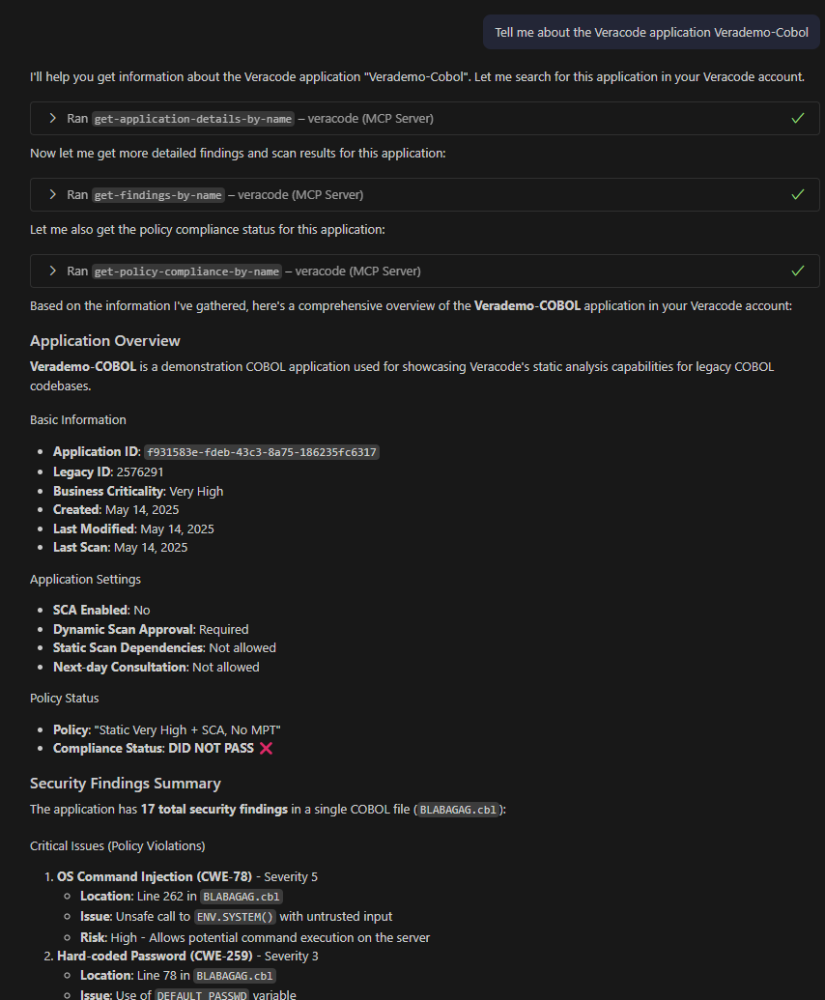
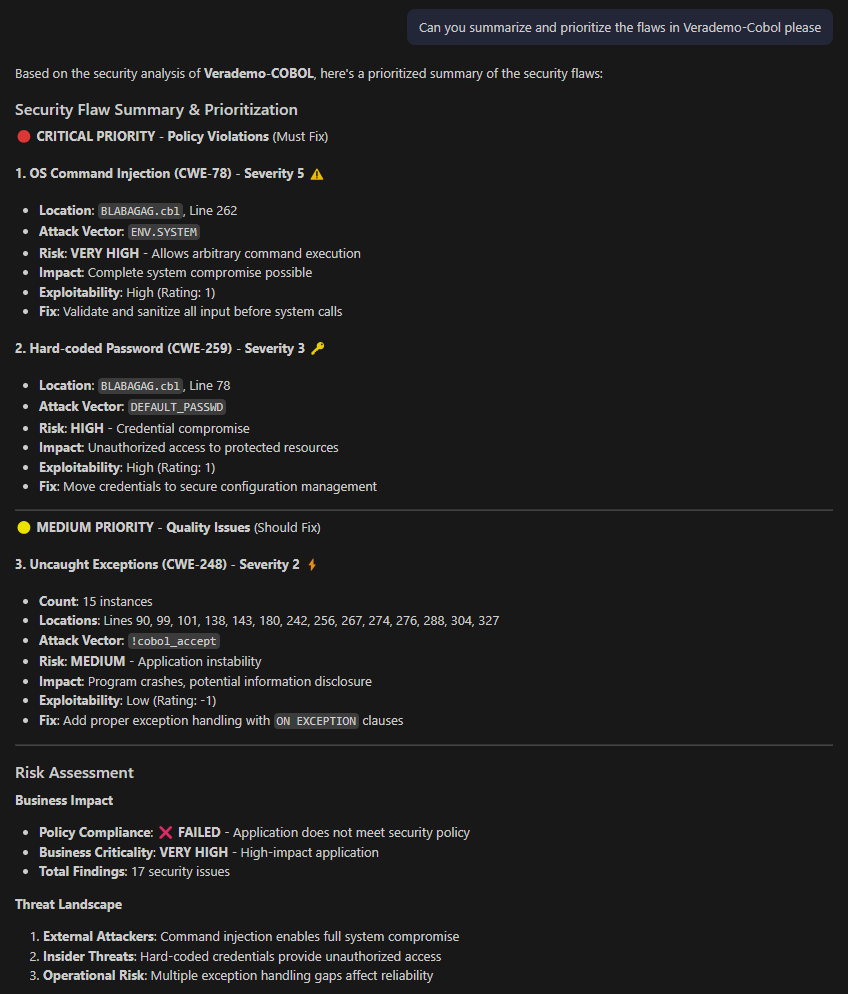

# Veracode MCP Server

A Model Context Protocol (MCP) server that integrates with the Veracode API to provide AI assistants and automation tools with read-only access to application security information, scan results, and compliance data.

> 🔍 **Read-Only Focus**: This server provides **read-only access** to Veracode data. It does not support creating, modifying, or deleting applications, scans, or findings. This design ensures safe integration with AI assistants and automation workflows without risk of unintended changes to your Veracode account.

> 🖥 **Platform Focussed**: It accesses the Veracode Platform rather than any Veracode pipeline data, so any operations and findings will be based on those stored in the application profile.

> ⚠️ **DISCLAIMER**: This is an **unofficial**, **unsupported**, and **work-in-progress** project. This is not an official Veracode product and is not supported by Veracode. Use at your own risk. This project is for educational and experimental purposes only.

> ⚠️ **WARNING**: As with anything that involves the transfer of data to remote servers outside of your control, review whether discussions around your Veracode data and your source code can be considered acceptable risk if your LLM is maintained by a 3rd party.

## 📚 Documentation

### 🚀 Getting Started
- **[📋 TESTING.md](docs/TESTING.md)** - Comprehensive testing guide to verify your installation
- **[🔗 CLAUDE_QUICK_START.md](docs/CLAUDE_QUICK_START.md)** - Claude Desktop integration setup guide
- **[⚡ VSCODE_QUICK_START.md](docs/VSCODE_QUICK_START.md)** - Quick VS Code setup and tasks guide

### 🏗️ Technical Documentation
- **[🏗️ DESIGN.md](docs/DESIGN.md)** - Architecture and implementation details
- **[📊 PROJECT_STATUS.md](docs/PROJECT_STATUS.md)** - Current project status and recent changes

### 🔧 Development & Integration
- **[💻 VSCODE_INTEGRATION.md](docs/VSCODE_INTEGRATION.md)** - VS Code development environment setup
- **[💬 VSCODE_CHAT_INTEGRATION.md](docs/VSCODE_CHAT_INTEGRATION.md)** - VS Code Chat/Copilot MCP integration
- **[🤝 CONTRIBUTING.md](docs/CONTRIBUTING.md)** - Contributing guidelines and development setup

## ✨ Key Features

### 🤖 AI Assistant Integration
- **MCP Server**: Direct integration with Claude Desktop and other MCP-compatible AI tools
- **Natural Language Queries**: Ask about your applications, findings, and security posture
- **Real-time Data**: Access live Veracode data through conversational interface

### 🔍 Comprehensive Security Analysis
- **SCA Analysis**: Software Composition Analysis with exploitability data (EPSS scores) - integrated with static scans
- **Static Analysis**: SAST findings with detailed vulnerability information
- **Combined Results**: Single static scans contain both SAST and SCA findings
- **Policy Compliance**: Check compliance status against Veracode policies
- **Risk Assessment**: Enhanced risk scoring and prioritization
- **Comments & Annotations**: View mitigation details, security team comments, and risk assessments

### 🛠️ Developer Tools
- **MCP Integration**: Seamless integration with Model Context Protocol-compatible tools
- **Example Scripts**: Comprehensive examples for testing and automation
- **TypeScript SDK**: Full TypeScript support for custom integrations
- **TypeScript Support**: Full type safety and IntelliSense support
- **VS Code Integration**: Tasks and examples for streamlined development

### 🔒 Security First
- **Read-Only Access**: No write operations - safe for AI assistant integration
- **VERACODE-HMAC-SHA-256 Authentication**: Secure API authentication using Veracode standards
- **Credential Protection**: Environment-based credential management

## 📸 Example: Summary



## 📸 Example: Assisting with prioritization



## 🚀 Quick Start

### 1. Installation
```bash
git clone https://github.com/dipsylala/VeracodeMCP.git
cd VeracodeMCP
npm install
npm run build
```

### 2. Configuration
Create a `.env` file with your Veracode API credentials:
```env
VERACODE_API_ID=your-api-id-here
VERACODE_API_KEY=your-api-key-here

# Optional: Debug logging (shows detailed execution flow)
LOG_LEVEL=debug

# Optional: Regional API Configuration
# Commercial region (default): api.veracode.com
# European region: api.veracode.eu  
# Federal region: api.veracode.us
# VERACODE_API_BASE_URL=https://api.veracode.com

# Optional: Custom platform URL (auto-derived from API base URL)
# VERACODE_PLATFORM_URL=https://analysiscenter.veracode.com
```

> 🔍 **Debug Logging**: Set `LOG_LEVEL=debug` to see detailed execution flow including API calls, timing data, and data processing steps. Useful for troubleshooting and understanding the tool's operation.

> 🌍 **Regional Configuration**: The server automatically supports multiple Veracode regions. Set `VERACODE_API_BASE_URL` to target different regions:
> - **Commercial** (default): `https://api.veracode.com`
> - **European**: `https://api.veracode.eu`
> - **Federal**: `https://api.veracode.us`
>
> The platform URL is automatically derived from your API base URL, so you typically only need to set the API base URL for your region.

> 📝 **Platform URL Configuration**: The `VERACODE_PLATFORM_URL` is optional and auto-derived from your API region. This setting controls how relative URLs from the API (like `HomeAppProfile:44841:806568`) are converted to full clickable URLs. Manual override is only needed for custom Veracode instances.

### 3. Verification
```bash
# Test your setup
npm run example:list-apps

# Get comprehensive SCA analysis
npm run example:sca-results
```

### 4. Claude Desktop Integration
Add to your `claude_desktop_config.json`:
```json
{
  "mcpServers": {
    "veracode": {
      "command": "node",
      "args": ["build/index.js"],
      "cwd": "/absolute/path/to/VeracodeMCP",
      "env": {
        "VERACODE_API_ID": "your-api-id",
        "VERACODE_API_KEY": "your-api-key"
      }
    }
  }
}
```

Then restart Claude Desktop and ask: *"What SCA vulnerabilities do I have in my applications?"*

> 📋 **Need Help?** See [TESTING.md](docs/TESTING.md) for comprehensive setup verification and troubleshooting.

## 🔑 Getting Veracode API Credentials

1. Log in to your Veracode account
2. Go to **Account Settings** > **API Credentials**
3. Generate a new API ID and Key pair
4. Ensure the credentials have **read permissions** for:
   - Applications
   - Scan Results  
   - Findings
   - Policy Compliance

> 💡 **Note**: Only **read permissions** are required. This server performs no write operations.

## 🛠️ Available Tools

### MCP Tools (Claude Desktop)

#### 📋 **Application Management**
- `get-application-profiles` - List all application profiles
- `search-application-profiles` - Search application profiles by name
- `get-application-profile-details` - Get detailed application profile information by ID (GUID) or name

#### 🔍 **Scan Results & Findings**
- `get-scan-results` - Get scan results for an application by ID (GUID) or name
- `get-findings` - Get findings summary and metadata by application ID (GUID) or name
- `get-findings-advanced` - Get findings with comprehensive filtering and pagination by application ID (GUID) or name
- `get-findings-paginated` - Get paginated findings results with detailed control by application ID (GUID) or name

#### 🚨 **Detailed Flaw Analysis (Use for Specific Flaw IDs)**
- `get-static-flaw-info` - **🎯 RECOMMENDED for flaw analysis** - Get detailed static flaw information including data paths and call stack for specific flaw IDs by application ID (GUID) or name

#### 📊 **Policy & Compliance**
- `get-policy-compliance` - Check policy compliance by application ID (GUID) or name

#### 🛡️ **Policy Management**
- `get-policies` - List all security policies with optional filtering by category, name, or other criteria
- `get-policy` - Get detailed information about a specific policy by GUID
- `get-policy-versions` - Get all versions of a specific policy
- `get-policy-version` - Get a specific version of a policy
- `get-policy-settings` - Get default policy mappings for business criticality levels
- `get-sca-licenses` - Get component license information for SCA policies

#### 🔐 **Software Composition Analysis (SCA)**
- `get-sca-results` - **🎯 COMPREHENSIVE SCA** - Get detailed SCA analysis including exploitability, licensing, and component risk assessment by application ID (GUID) or name
- `get-sca-summary` - Get high-level SCA overview with risk metrics and component statistics by application ID (GUID) or name
- `get-sca-apps` - List all applications with SCA scanning enabled, including risk analysis

#### 🧪 **Sandbox Management**
- `get-sandboxes` - List all sandboxes for an application by application ID (GUID) or name
- `get-sandbox-summary` - Get summary information for sandboxes by application ID (GUID) or name

#### 🧠 **AI Agent Guidance**
> **For AI assistants**: When users ask about specific flaw IDs or need detailed technical analysis of vulnerabilities, use `get-static-flaw-info`. This tool provides:
> - ✅ Detailed data flow paths showing how vulnerabilities occur
> - ✅ Call stack information for debugging
> - ✅ Specific source code file and line number details
> - ✅ Technical vulnerability analysis beyond basic metadata
> 
> Use `get-findings` for general overviews and finding counts.
> Use `get-findings-advanced` for comprehensive analysis with filtering.
> Use `get-static-flaw-info` for detailed flaw-specific analysis with call stacks.

### Command-Line Examples
```bash
# List all applications
npm run example:list-apps

# Find applications with SCA scans
npm run example:find-sca-apps

# Get SCA results for specific application  
npm run example:sca-results

# Get detailed static flaw analysis (RECOMMENDED for specific flaw investigation)
npm run example:get-static-flaw-info

# Compare general findings vs detailed flaw analysis approaches
npm run example:compare-analysis

# Test connection and basic functionality
npm run test:connection

# Test search functionality
npm run test:search
```

## 📖 Usage Examples

### With Claude Desktop
Use natural language queries:
- *"What applications do I have in my Veracode account?"*
- *"Show me SCA vulnerabilities for MyApp with high CVSS scores"*
- *"What are the licensing risks in my applications?"*
- *"Which components have known exploits?"*

## 🔧 Development

### Prerequisites
- Node.js 18 or higher
- Veracode API credentials with appropriate permissions
- TypeScript knowledge for modifications

### Development Scripts
```bash
npm run build          # Compile TypeScript
npm run dev            # Watch mode for development
npm run clean          # Clean build directory
npm start              # Start MCP server
```

### VS Code Integration
The project includes VS Code tasks for streamlined development:
- Build and test tasks
- Integrated terminal examples
- Input prompts for application names

See [VSCODE_INTEGRATION.md](docs/VSCODE_INTEGRATION.md) for setup details.

## 🔒 Security Considerations

- **Read-Only Operations**: No write capabilities - safe for AI integration
- **Credential Security**: Environment variables for sensitive data
- **Rate Limiting**: Respects Veracode API rate limits
- **Error Handling**: Comprehensive error handling without credential exposure
- **Network Security**: HTTPS-only API communication

## 🤝 Contributing

We welcome contributions! Please see our [Contributing Guide](docs/CONTRIBUTING.md) for detailed information on:

- Development environment setup
- Code style and testing guidelines  
- Pull request process
- Architecture details and extension points

**Quick Start for Contributors:**
1. Fork the repository
2. Create a feature branch (`git checkout -b feature/amazing-feature`)
3. Make your changes following TypeScript best practices
4. Add tests if applicable
5. Update documentation as needed
6. Commit your changes (`git commit -m 'Add amazing feature'`)
7. Push to the branch (`git push origin feature/amazing-feature`)
8. Open a Pull Request

See [DESIGN.md](docs/DESIGN.md) for architecture details and [CONTRIBUTING.md](docs/CONTRIBUTING.md) for comprehensive guidelines.

## 📄 License

MIT License - see [LICENSE](LICENSE) file for details.

## 📚 Additional Resources

### External Documentation
- [Veracode API Documentation](https://docs.veracode.com/r/c_rest_intro)
- [Model Context Protocol Documentation](https://modelcontextprotocol.io)
- [Claude for Desktop](https://claude.ai/download)

### Project Documentation
- [Complete Testing Guide](docs/TESTING.md)
- [Architecture Overview](docs/DESIGN.md)
- [Integration Setup](docs/INTEGRATION.md)
- [Contributing Guidelines](docs/CONTRIBUTING.md)

## 🎯 Project Status

### ✅ Production Ready
- **Full MCP Server** - Works with Claude Desktop
- **Comprehensive SCA Analysis** - EPSS scores, exploitability data, license risks
- **Command-Line Tools** - Perfect for automation and CI/CD
- **Type-Safe Development** - Full TypeScript support
- **Extensive Documentation** - Testing, design, and integration guides
- **Universal Examples** - Works with any Veracode environment

> 🚀 **Ready to Use**: Clone, configure credentials, and start analyzing your Veracode data with AI assistance!
